# 健康生活管家 Software Design Document (SDD)

## 1. Introduction

- **Purpose**
  本文件為健康生活管家應用程式的軟體設計文件（SDD），旨在詳細闡述系統架構、功能模組、資料庫設計、技術棧、非功能需求、測試策略與部署運維，作為開發、測試、維護的技術參考基準。

- **Scope**  
  系統提供 AI 智能健康飲食管理、食物掃描辨識與營養分析、個人化菜單推薦與購物清單生成、每日飲食追蹤與建議、運動與睡眠整合、提醒與通知等；涵蓋使用者資料管理、餐食資料庫、圖像辨識與 NLP、行為分析、報表與目標管理。

- **References**
  - 公開營養資料來源（如衛福部食物營養成分資料集）  
  - 作業系統與框架官方文件（Android/iOS、Node.js、Python、PostgreSQL）

## 2. System Overview

- **System Description**  
  健康生活管家是一款以 AI 為核心的行動應用程式，透過使用者的健康資料與飲食行為進行分析，提供個人化餐單、即時掃描辨識食物營養、每日飲食追蹤與建議、並生成改善建議與目標管理。系統包含行動端 App、後端服務、資料庫、AI 模型、第三方 API 整合，支援多語與本地化。

- **Design Goals**  
  - 精準個人化推薦（餐單、營養比例、改善建議）  
  - 高效食物辨識與營養計算  
  - 資料隱私與安全保護  
  - 高可用性與可擴展性  
  - 直覺易用的使用者介面  
  - 清晰任務模組化與可維護性

- **Architecture Summary**  
  採用分層式微服務架構：  
  - 客戶端（iOS/Android）：UI/UX、拍照掃描、同步、通知  
  - API Gateway：驗證、路由、速率限制  
  - 應用服務：使用者管理、餐單推薦、掃描辨識、追蹤與建議、報表  
  - AI 服務：圖像辨識、營養推論、個人化推薦模型  
  - 資料層：關聯式資料庫（PostgreSQL/MySQL）、文件儲存
  - 整合：第三方食材 API、推播服務

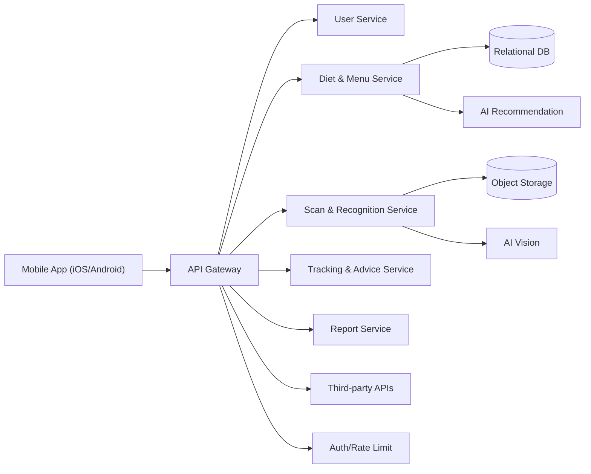

## 3. Architectural Design

- **Component Breakdown**  
  - 使用者管理（User Service）：帳號、個資、健康目標、過敏史、偏好、設定  
  - 餐食資料庫（Diet DB Service）：食材、營養成分、熱量、分類  
  - AI 推薦（AI Recommendation Service）：依個人健康狀況與目標生成菜單  
  - 食物掃描辨識（Vision Service）：相機掃描、影像分類、NLP  
  - 追蹤與建議（Tracking & Advice）：每日飲食記錄、趨勢分析、行為建議  
  - 通知與提醒（Notification）：餐時提醒、目標達成
  - 報表（Report）：週/月報表、KPI 指標、目標進度  
  - 系統管理（Admin）：權限、審計、設定、監控

- **Technology Stack**  
  - 前端：Flutter/React Native；支援 iOS/Android  
  - 後端：Node.js（NestJS/Express）或 Python（FastAPI）
  - AI：Python、PyTorch/TensorFlow；LLM/NLP 模型
  - 資料庫：PostgreSQL、Redis
  - 基礎設施：Docker、Kubernetes、CI/CD、API Gateway
  - 監控：Prometheus、Grafana、ELK、Sentry

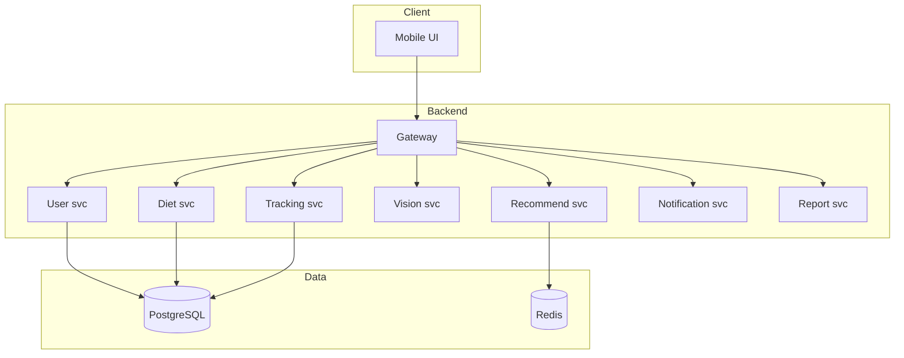

- **Functional Requirements**
  - Task 1.1（用戶資料輸入介面）
  - Task 1.2（建立健康餐食資料庫）
  - Task 1.3（個性化菜單推薦）
  - Task 1.4（掃描食物辨識營養成分）
  - Task 1.5（追蹤與建議）
  - Task 1.6（生成購物清單）
  - Task 1.7（每日飲食數據追蹤）
  - Task 1.8（提醒與通知）
  - Task 1.9（報表）
  - Task 1.10（目標管理）
- **Non-Functional Requirements**
  - Task 2.1（性能優化）
  - Task 2.2（安全性與隱私保護）
  - Task 2.3（使用者體驗與易用性）
  - Task 2.4（可維護性）
  - Task 2.5（可擴展性）

## 4. Detailed Design

### 4.1 使用者與健康資料模組

- 任務對應：**Task 1.1（用戶資料輸入介面）**
- 功能：建立使用者資料（飲食習慣、健康目標、過敏史、身體狀況）、偏好設定
- 輸入：使用者表單資料；身高、體重、年齡、性別、活動量、疾病史
- 輸出：使用者設定檔；BMI 計算結果；偏好標籤
- 流程：
  1. UI 表單輸入 → 基本驗證
  2. 後端計算 BMI，生成健康目標建議
  3. 儲存至資料庫 `users`, `user_profiles`, `preferences`
- 驗收標準：
  - 必填欄位驗證與錯誤提示完整
  - 成功儲存與同步跨裝置
  - 建議值計算正確（對照公式）
- 類別圖：

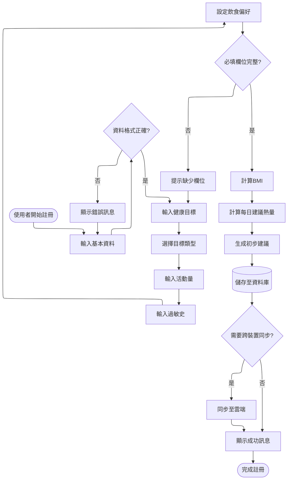

### 4.2 餐食資料庫模組

- 任務對應：**Task 1.2（建立健康餐食資料庫）**
- 功能：維護食材、營養成分、熱量與分類
- 輸入：食材資料；外部營養資料集
- 輸出：可查詢之食材/營養 API
- 流程：
  1. 資料匯入與清洗
  2. 建立索引與分類標籤（過敏、素食、低醣等）
  3. 提供查詢端點（以名稱/條碼/成分）
- 驗收標準：
  - 資料覆蓋率 ≥ 95% 常見食材
  - 查詢延遲 ≤ 200ms（快取）
  - 萬用過敏標籤一致性

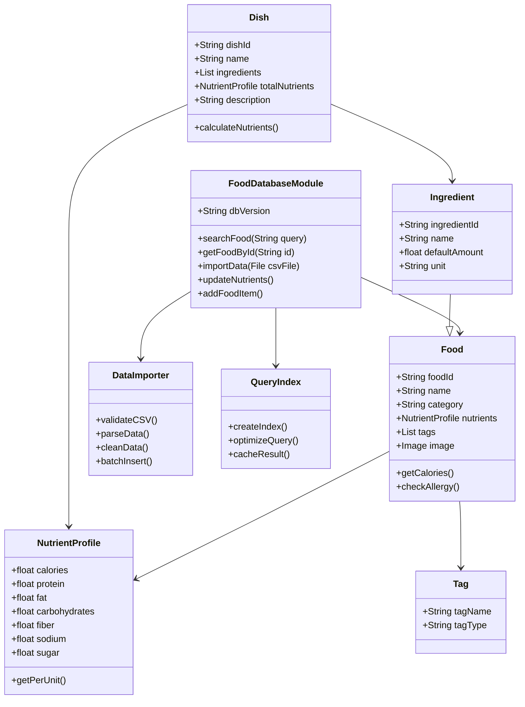

### 4.3 AI 個人化推薦模組

- 任務對應：**Task 1.3（個性化菜單推薦）、Task 1.5（追蹤與建議）**
- 功能：依使用者目標與狀況生成菜單；持續優化建議
- 輸入：使用者檔案、偏好、歷史飲食記錄、營養資料庫
- 輸出：日/週菜單、營養配比、熱量目標達成度
- 流程：
  1. 特徵工程（健康目標、過敏、偏好、活動量）
  2. 模型推論（Rule-based + ML Ranking）
  3. 生成菜單
  4. 追蹤每日記錄，調整建議
- 驗收標準：
  - 達成目標的推薦正確性（A/B 測試提升 ≥ 10%）
  - 避免過敏食材
  - 使用者滿意度調查達標

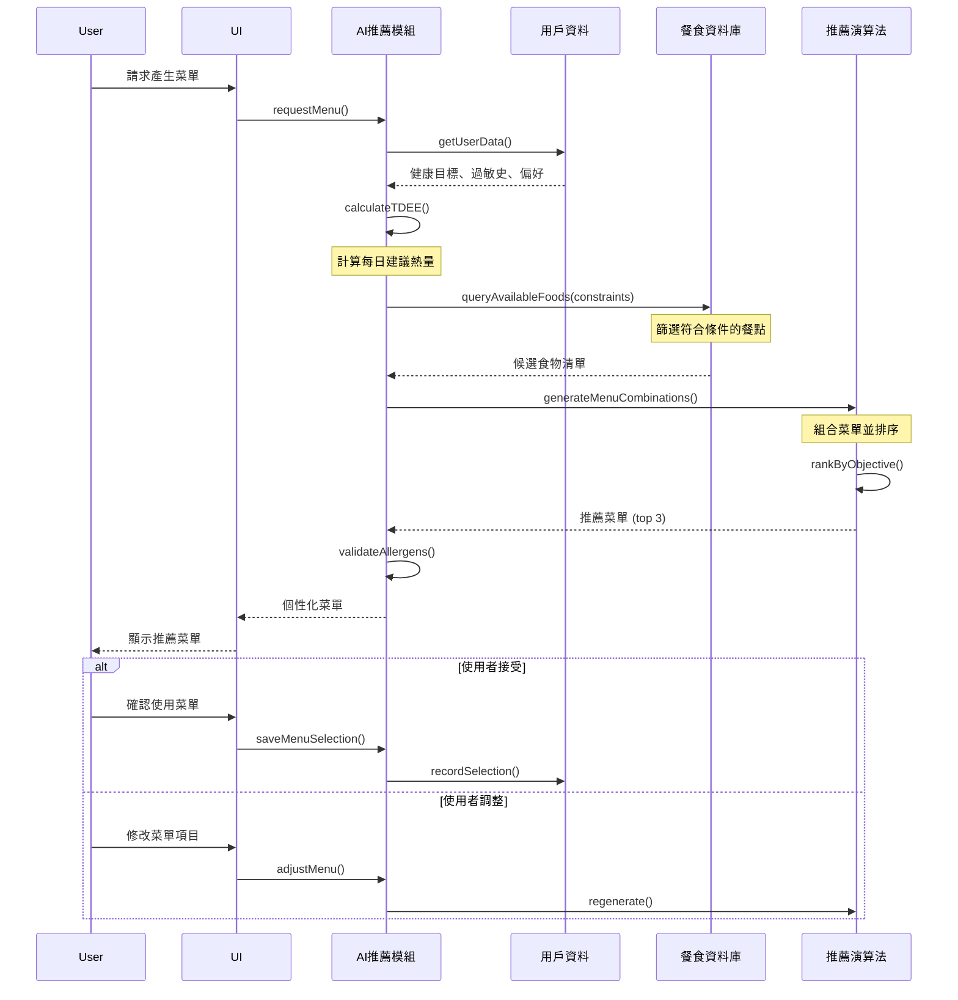

### 4.4 食物掃描與營養辨識模組

- 任務對應：**Task 1.4（掃描食物辨識營養成分）**
- 功能：影像/條碼掃描，辨識食物與營養
- 輸入：相機影像、條碼文字、包裝標示 OCR
- 輸出：辨識食物名稱、營養成分、份量估計
- 流程：
  1. 影像前處理 → 分類/偵測模型
  2. 條碼解析 → 產品資料匹配
  3. OCR → 營養標示抽取 → NLP 正規化
  4. 輸入資料庫並關聯菜餚/食材
- 驗收標準：
  - 辨識準確率 ≥ 90%（常見食物集）
  - 條碼解析成功率 ≥ 95%
  - OCR/NLP 誤差率 ≤ 5%

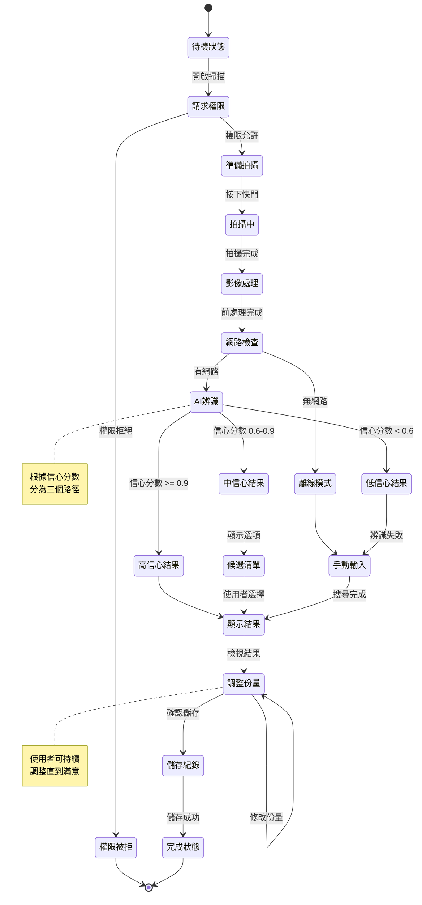

### 4.5 購物清單與電商整合模組

- 任務對應：**Task 1.6（生成購物清單）**
- 功能：依菜單生成可購買之食材清單；庫存與替代品
- 輸入：菜單、家中庫存、偏好（品牌/價格）
- 輸出：購物清單（分店/電商）、替代建議
- 流程：
  1. 菜單→食材分解→合併週期需求
  2. 對照庫存與替代品表
  3. 產出清單並可一鍵加入電商購物車（API）
- 驗收標準：
  - 清單覆蓋率 ≥ 98%
  - 替代品建議符合過敏/偏好約束

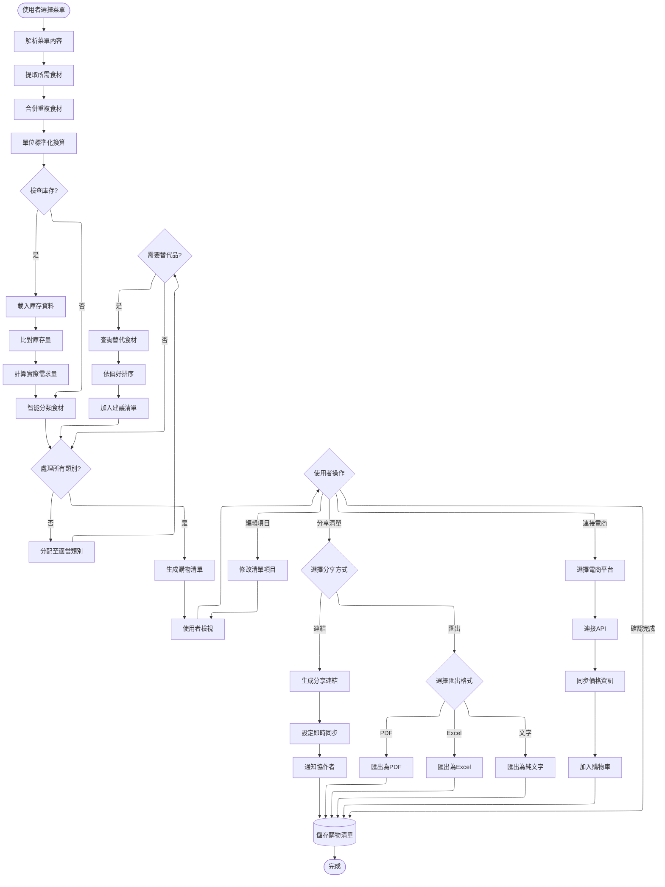

### 4.6 飲食追蹤與建議模組

- 任務對應：**Task 1.7（每日飲食數據追蹤）、Task 1.5（改善建議）**
- 功能：記錄每日飲食、營養匯總、趨勢分析、健康提醒
- 輸入：手動記錄、掃描辨識結果、第三方裝置資料
- 輸出：每日/週/月營養與熱量報表；建議
- 流程：
  1. 記錄事件（早餐/午餐/晚餐/零食）
  2. 營養匯總與目標對齊
  3. 偏差分析 → 推送建議/提醒
- 驗收標準：
  - 記錄完成率與一致性
  - 建議對偏差具體有效（回歸/迴圈測試）
  - 通知推送可靠

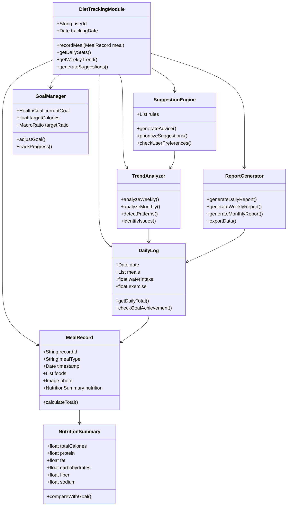

### 4.7 通知與提醒模組

- 任務對應：**Task 1.8（提醒與通知）**
- 功能：餐時提醒、補充水分、達標提示、購物提醒
- 輸入：使用者目標、行程、時區
- 輸出：App 內通知、推播
- 流程：
  1. 設定排程與條件
  2. 推播服務
  3. 點擊行動（開啟菜單/清單/記錄）
- 驗收標準：
  - 準時送達率 ≥ 99%
  - 不重複或騷擾（頻率控制與退訂）
  - 行動轉換率 KPI 追蹤

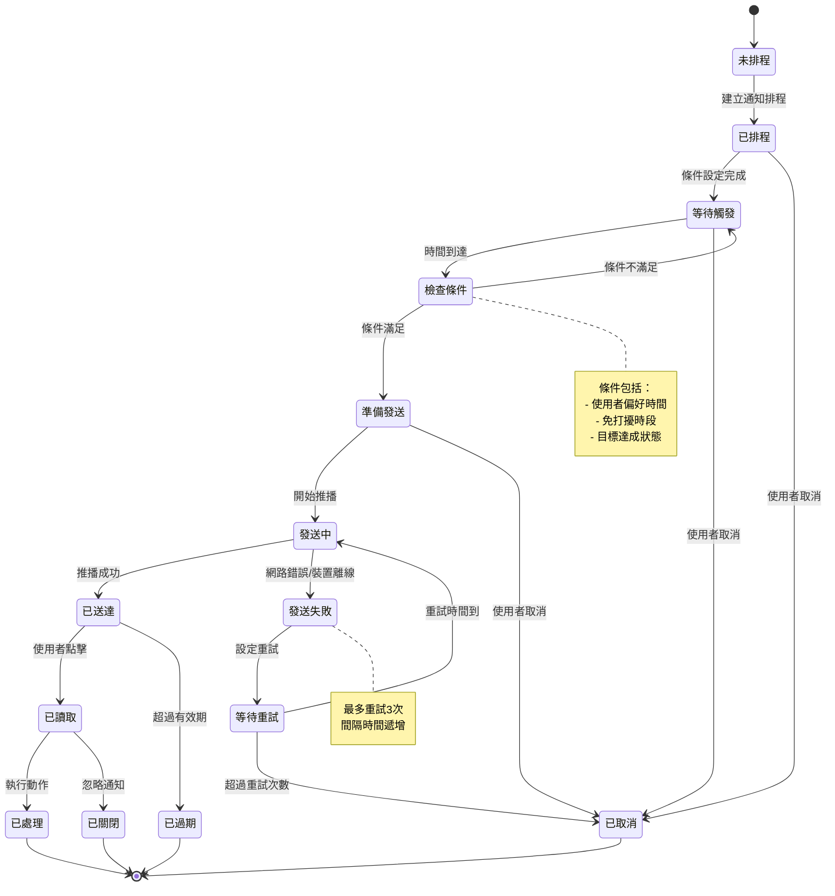

### 4.8 報表與目標管理模組

- 任務對應：**Task 1.9（報表）、Task 1.10（目標管理）**
- 功能：週/月報表、KPI 指標、目標設定與進度追蹤
- 輸入：歷史記錄、目標、偏好
- 輸出：圖表（熱量、營養價值、達標率）、目標狀態、建議
- 流程：
  1. 聚合計算與指標生成
  2. 視覺化（圖表元件）
  3. 目標與提醒耦合
- 驗收標準：
  - 指標計算正確（交叉驗證）
  - 圖表載入 < 1s（快取）
  - 使用者可操作性良好

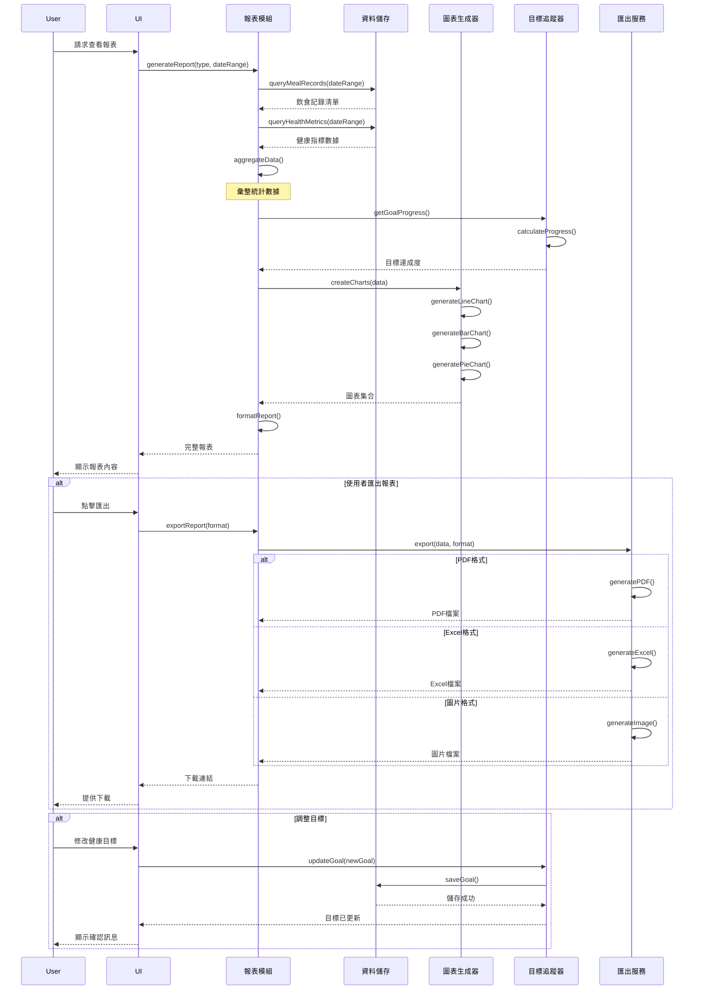

## 5. Database Design

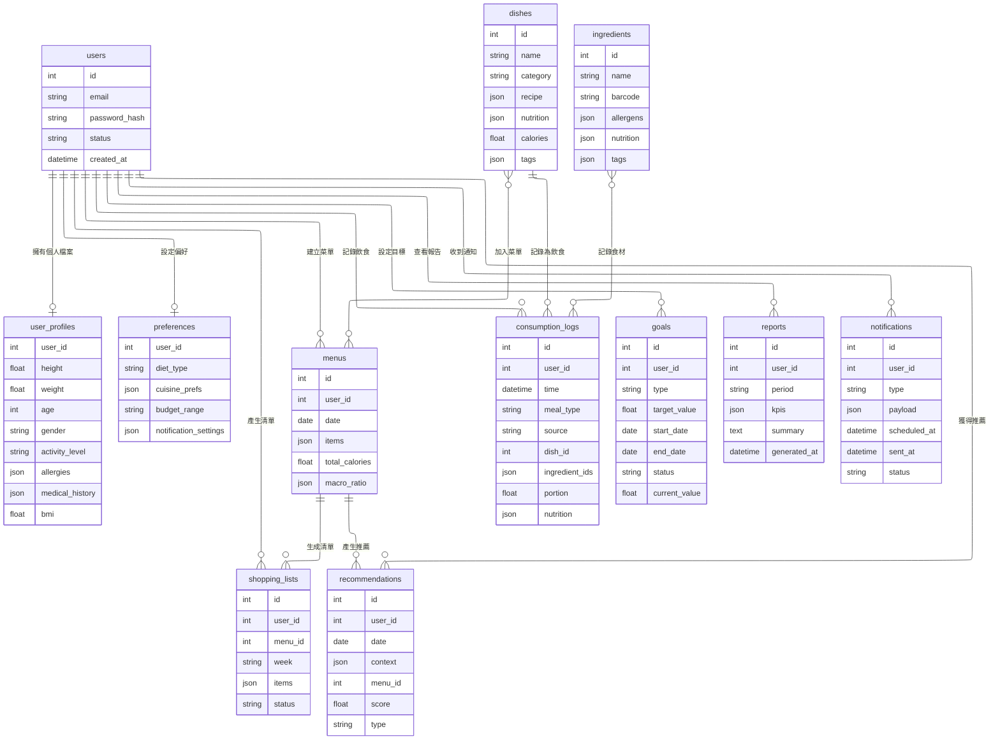

## 6. Non-Functional Requirements

- **性能（Performance）**
  - 主要 API 延遲 ≤ 300ms；掃描辨識端到端 ≤ 2s
  - 每日活躍 10k 用戶下維持 ≥ 99.9% 可用性
  - 資料庫查詢優化與索引完整；批次作業離峰執行

- **安全（Security）**
  - OAuth2/OpenID Connect；JWT；雙因素驗證（選擇性）
  - 靜態/傳輸加密（AES-256、TLS 1.2+）；秘密管理（Vault/KMS）
  - RBAC 權限；審核日誌；GDPR/CCPA 合規；隱私遮罩

- **可用性（Usability**）
  - 無障礙 AA 級（文字放大、色彩對比、語音輔助）
  - 專注於低認知負擔之流程與介面設計
  - 離線模式支援基本功能（資料緩存、同步）
  - 國際化與在地化（繁中優先）

- **維護性（Maintainability）**
  - 程式碼規範（ESLint/Black）；單元測試覆蓋率 ≥ 80%
  - 版本化管理
  - 自動化 CI/CD 流程
  - 集中化日誌與監控（ELK、Prometheus/Grafana）

- **可擴展性（Scalability）**
  - 水平擴展（K8s HPA）
  - 快取與排隊（Redis/Queue）；影像與模型分離部署
  - 分割讀寫與資料庫分片

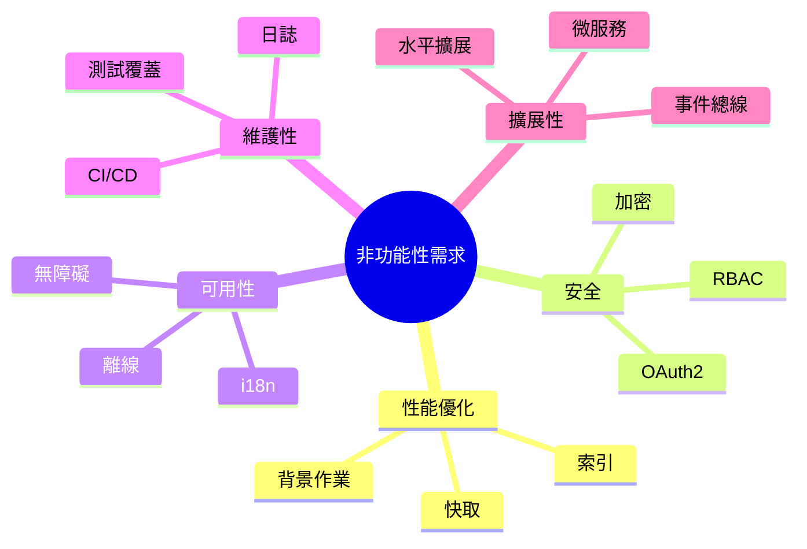

## 7. Testing Strategy

- 測試層級
  - 單元測試：服務邏輯、模型推論、資料庫操作
  - 整合測試：API 合約、跨服務流程（推薦→清單→通知）
  - 端到端測試（E2E）：使用者場景（建立目標→掃描→生成菜單→追蹤→報表）
  - 性能測試：負載、壓力、延遲監控
  - 安全測試：權限驗證、資料洩漏檢查

- 測試案例
  1. 用戶資料建立與驗證  
     - 前置：新用戶  
     - 步驟：填寫資料→提交→查詢 profile  
     - 期望：必填驗證、BMI正確、資料持久化成功
  2. 菜單推薦避開過敏食材  
     - 前置：設定花生過敏  
     - 步驟：生成週菜單  
     - 期望：菜單中不含花生/其衍生物
  3. 食物掃描條碼解析  
     - 前置：已知產品條碼  
     - 步驟：掃描→比對資料庫  
     - 期望：返回正確產品與營養
  4. 購物清單生成與電商下單  
     - 前置：既有菜單與庫存  
     - 步驟：生成清單→推送到電商  
     - 期望：清單完整且下單 API 成功
  5. 每日飲食追蹤與建議  
     - 前置：連續三天高糖攝取  
     - 步驟：匯總→生成建議→通知  
     - 期望：建議具體、通知送達、可操作連結
  6. 報表與目標達成率  
     - 前置：一週完整記錄  
     - 步驟：生成週報表  
     - 期望：數據一致、載入迅速、圖表正確
  7. 非功能測試（性能/安全）  
     - 負載 1k ≤ 300ms  
     - 權限測試：未授權請求被拒
     - 資料加密驗證

## 8. Stakeholders & Team Structure

- **Stakeholders**

| 角色 | 職責與說明 |
|---|---|
| 系統使用者 | 注重健康飲食、希望透過 App 管理個人飲食習慣與健康的最終用戶。他們是系統服務的主要對象，其需求和反饋是專案成功的關鍵。 |
| 系統管理員 | 負責管理與維護 App 後台內容的人員。主要工作包含維護健康餐食資料庫、審核資訊、管理使用者回饋等，確保內容的正確性與即時性。 |
| 系統維護者 | 負責確保系統伺服器、資料庫和整體應用程式穩定運行的技術人員。他們處理系統部署、監控性能、進行例行維護與故障排除。 |
| 系統開發者 | 負責 App 所有功能開發與實作的團隊成員，包含前後端程式設計、AI 模型整合與資料庫建構等。他們需要將需求轉化為實際的應用程式功能。 |
| 客服人員 | 作為使用者與開發團隊之間的橋樑，負責收集、整理並回覆使用者的問題、建議與錯誤回報，協助提升使用者體驗。 |

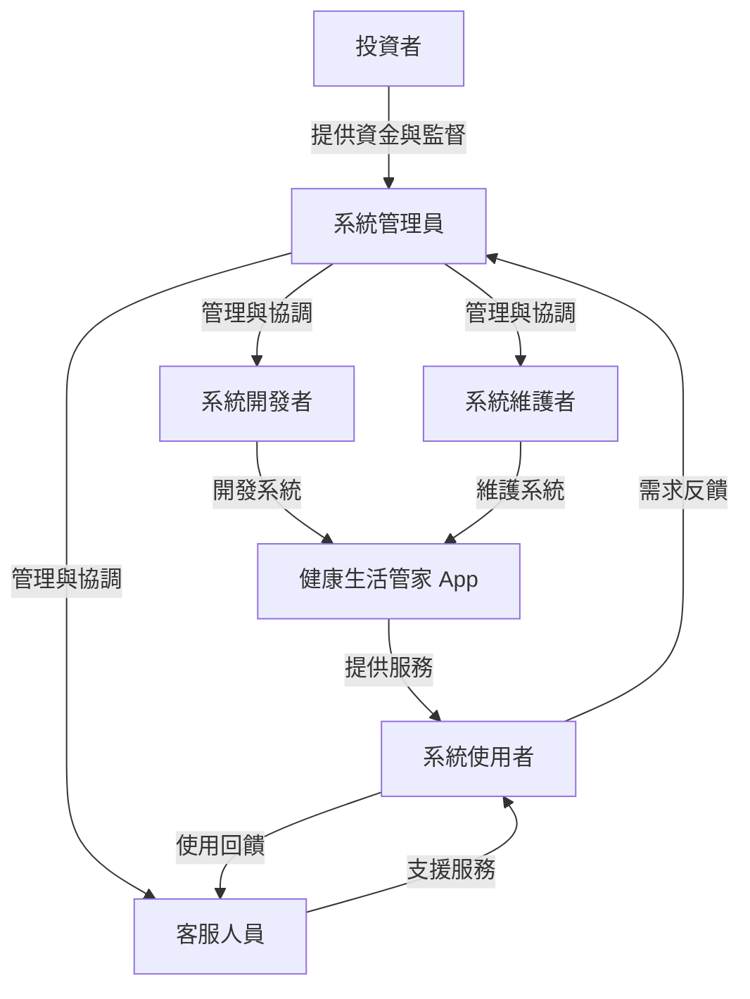

- **團隊成員與任務分工**
  - B1243017 吳彥廷
  - B1243009 陳彥儒
  - B1243005 曹哲維
  - B1243001 江珩安
  - B1243018 王翃陞

## 9. Risk Analysis

- 模型準確率不足影響推薦品質（緩解：持續擴建資料集與標註與 A/B 測試）
- OCR/NLP 在包裝標示不一致時錯誤率高（緩解：規則校正與增加人為審核介面）
- 電商 API 變更導致整合失效（緩解：API 版本化與回退機制）
- 隱私與法規風險（緩解：資料最小化、加密、合規審查）
- 系統高峰期性能瓶頸（緩解：水平擴展、快取、異步化）

## 10. Deployment & Operations

- 部署：容器化（Docker）、Kubernetes、分環境（Dev/Staging/Prod）
- 配置：集中化設定（ConfigMap/Secrets）、版本控管
- 監控：APM、指標、日誌；異常自動告警
- 災難復原：多區域備援、每日備份、RTO/RPO 目標
- 滾動更新；回滾機制

## 11. Appendices

- API 範例
  - 建立使用者偏好
    - POST /api/v1/users/{id}/preferences  
      請求：

      ```json
      {
        "diet_type": "low_carb",
        "cuisine_prefs": ["japanese", "mediterranean"],
        "notification_settings": {"meal_reminder": true}
      }
      ```

      回應：

      ```json
      {"status":"ok","updated":true}
      ```

  - 生成週菜單
    - POST /api/v1/menus/generate  
      請求：

      ```json
      {"user_id":123,"week":"2025-W01","constraints":{"allergies":["peanut"],"budget":50}}
      ```

      回應：

      ```json
      {"menu_id":456,"total_calories":14000,"macro_ratio":{"carb":0.45,"protein":0.25,"fat":0.30}}
      ```
